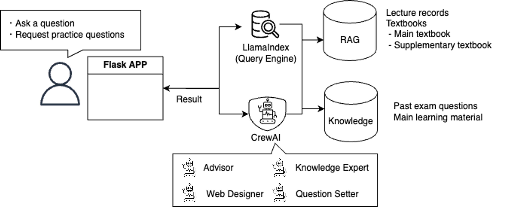
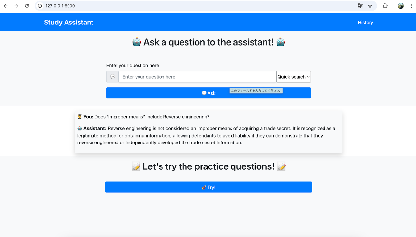

# AI Study Assistant 

This is my final project for the "LLM for Business with Python" class at Stanford Continuing Studies. 


AI Study Assistant supports Stanford students by providing useful parts of past lectures and textbooks according to the questions from students.

### Background
International students sometimes have problems following lectures in real time. Therefore, many students usually record lectures with an application, e.g. otter.ai, which allows us to export scripts into text files. They want to use the data efficiently when they prepare for exams.
Also, students want to study with the main material or their notebook. But they have a lot of sub-materials. They might want to retrieve important or useful information from sub-materials while they study the main material. 


# How it works


### Approach
This assistant has all the scripts of past lectures, textbooks, and relevant documents in RAG.
When a user asks the assistant about some topics, it will return what the professor explained from the past lectures and relevant parts from textbooks.
If we have data of past exam or example questions, this assistant can have an option to create practice questions.

### Data
- Scripts of lecture records
- Textbooks
- Past exam

# Quick start
1. Place materials you want to study in the `data` directory and `src/knowledge`.
```
$ tree
.
├── LICENSE
├── README.md
├── data
│   ├── Record
│   │   ├── Note_20250107_otter_ai.pdf
│   │   ....
│   │   └── Note_20250225_otter_ai.pdf
│   └── Textbook
│       └── textbook.pdf
├── knowledge
│   ├── main_material.pdf
│   └── past_question.pdf
└── src
    ├── app.py
    ├── setup_crewai_agents.py
    ├── setup_llamaindex.py
    └── templates
        ├── history.html
        └── index.html
```

2. Install packages
```
pip install flask
pip install "crewai[tools]"
pip install llama-index
```

3. Prepare `.env` file
```
OPENAI_API_KEY = "YOUR_API_KEY"
LLM_MODEL = "gpt-4o-mini"
PAST_QUESTION_FILE = "past_question.pdf" # File name placed in the knowledge directory
MAIN_MATERIAL_FILE = "main_material.pdf" # File name placed in the knowledge directory
```

4. Start Flask app
```
$ python src/app.py
```

5. Access Web page: http://127.0.0.1:5000/

